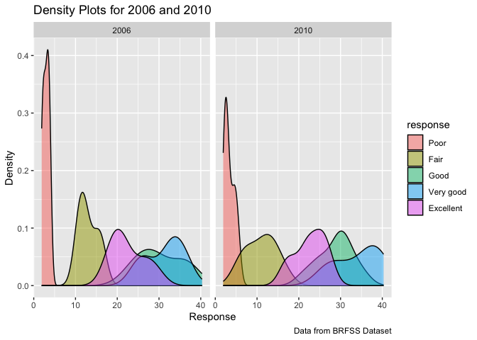
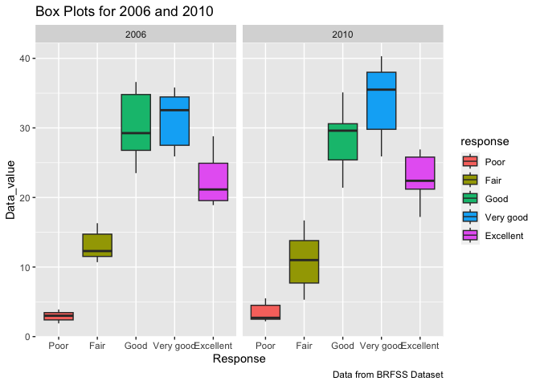

p8105_hw3_cl4469
================
Chen Liang
2023-10-07

``` r
data("instacart")
```

``` r
instacart %>% select(product_id) %>% distinct %>% count()
```

    ## # A tibble: 1 × 1
    ##       n
    ##   <int>
    ## 1 39123

``` r
instacart %>% select(user_id, order_id) %>% distinct %>% count 
```

    ## # A tibble: 1 × 1
    ##        n
    ##    <int>
    ## 1 131209

``` r
instacart %>% select(user_id) %>% distinct %>% count
```

    ## # A tibble: 1 × 1
    ##        n
    ##    <int>
    ## 1 131209

``` r
instacart |>
  group_by(aisle) |>
  summarize(n_obs=n()) |>
  arrange(desc(n_obs))
```

    ## # A tibble: 134 × 2
    ##    aisle                          n_obs
    ##    <chr>                          <int>
    ##  1 fresh vegetables              150609
    ##  2 fresh fruits                  150473
    ##  3 packaged vegetables fruits     78493
    ##  4 yogurt                         55240
    ##  5 packaged cheese                41699
    ##  6 water seltzer sparkling water  36617
    ##  7 milk                           32644
    ##  8 chips pretzels                 31269
    ##  9 soy lactosefree                26240
    ## 10 bread                          23635
    ## # ℹ 124 more rows

``` r
max(pull(instacart,aisle_id))
```

    ## [1] 134

This is a table showing the number of items ordered from aisle. There
are 134 aisles.And the most items ordered from aisles are fresh
vegetables and fresh fruits.

``` r
instacart |>
  count(aisle) |>
  filter(n > 10000) |>
  mutate(aisle=fct_reorder(aisle, n)) |>
  ggplot(aes(x=aisle,y=n))+
  geom_point()+
  labs(
    title="Number of items ordered in each aisle",
    x="Aisle",
    y="Number of items (n)",
    caption = "Data from the instacart package")+
  theme(axis.text.x = element_text(angle = 90, hjust = 1),
        axis.text = element_text(size = 7.5) )
```

<!-- -->
Here is a plot that shows the number of items ordered in each aisle. And
aisles are ordered by ascending number of items.

``` r
rank_3 <- instacart |> 
  filter(aisle %in% c("baking ingredients","dog food care","packaged vegetables fruits")) |>
  group_by(aisle,product_name)|>
  summarise(n=n()) |>
  mutate(product_ranking=min_rank(desc(n))) |>
  filter(product_ranking < 2)
```

    ## `summarise()` has grouped output by 'aisle'. You can override using the
    ## `.groups` argument.

``` r
knitr::kable(rank_3, caption = "Most Popular Item in Each of The Aisles")
```

| aisle                      | product_name                                  |    n | product_ranking |
|:---------------------------|:----------------------------------------------|-----:|----------------:|
| baking ingredients         | Light Brown Sugar                             |  499 |               1 |
| dog food care              | Snack Sticks Chicken & Rice Recipe Dog Treats |   30 |               1 |
| packaged vegetables fruits | Organic Baby Spinach                          | 9784 |               1 |

Most Popular Item in Each of The Aisles

This table shows the three most popular items in aisles
`baking ingredients`, `dog food care`, and `packaged vegetables fruits`,
and includes the number of times each item is ordered.

``` r
instacart |>
  filter(product_name %in% c("Pink Lady Apples","Coffee Ice Cream")) |>
  group_by(product_name, order_dow) |>
  summarise(mean_hour= mean(order_hour_of_day)) |>
  spread(key = order_dow, value = mean_hour) |>
  knitr::kable(caption = "Mean Hour of The Day 2 Items Are Ordered ", digits = 2)
```

    ## `summarise()` has grouped output by 'product_name'. You can override using the
    ## `.groups` argument.

| product_name     |     0 |     1 |     2 |     3 |     4 |     5 |     6 |
|:-----------------|------:|------:|------:|------:|------:|------:|------:|
| Coffee Ice Cream | 13.77 | 14.32 | 15.38 | 15.32 | 15.22 | 12.26 | 13.83 |
| Pink Lady Apples | 13.44 | 11.36 | 11.70 | 14.25 | 11.55 | 12.78 | 11.94 |

Mean Hour of The Day 2 Items Are Ordered

This table shows the mean hour of the day at which Pink Lady Apples and
Coffee Ice Cream are ordered on each day of the week. The result is a
2x7 table. There are 7 variables as column names ranging from 0 to 6,
the row are the specific day in a week. The cell values are means of the
hours of each day in a week. From this table, we can see Pink Lady
Apples are generally purchased slightly earlier in the day than Coffee
Ice Cream, with the exception of day 5.

## Problem 2

``` r
data("brfss_smart2010")
```

#### Data cleaning:

``` r
brfss_df=
  brfss_smart2010 |>
  janitor::clean_names() |>
  filter(topic=="Overall Health",
         response %in% c("Excellent", "Very good", "Good", "Fair", "Poor")) |>
  mutate(response = fct_relevel(response, "Poor", "Fair", "Good", "Very good", "Excellent"))

  
# which one is better? 
#mutate(response = fct_relevel(response, "Poor", "Fair", "Good", "Very good", "Excellent"))
#mutate(response = factor(response, ordered =TRUE, levels = c("Poor", "Fair", "Good", "Very Good", "Excellent")))

# mutate(response = factor(...)): This approach converts the "response" column into a completely new ordered factor variable. The resulting factor will have the specified levels and will be ordered as specified.
# mutate(response = fct_relevel(response, ...)): This approach doesn't change the factor's order but only reorders the levels within the existing factor. It can be used to change the order of levels without changing the data type from factor to a different data type.
```

``` r
brfss_df |> 
  filter(year==2002 | year==2010) |>
  group_by(year,locationabbr,locationdesc) |>
  summarize(n=n()) |>
  count(locationabbr,name = "locations") %>% 
    filter(locations >= 7) %>% 
  pivot_wider(
    names_from = year,
    values_from = locations
  )
```

    ## `summarise()` has grouped output by 'year', 'locationabbr'. You can override
    ## using the `.groups` argument.

    ## # A tibble: 15 × 3
    ## # Groups:   locationabbr [15]
    ##    locationabbr `2002` `2010`
    ##    <chr>         <int>  <int>
    ##  1 CT                7     NA
    ##  2 FL                7     41
    ##  3 MA                8      9
    ##  4 NC                7     12
    ##  5 NJ                8     19
    ##  6 PA               10      7
    ##  7 CA               NA     12
    ##  8 CO               NA      7
    ##  9 MD               NA     12
    ## 10 NE               NA     10
    ## 11 NY               NA      9
    ## 12 OH               NA      8
    ## 13 SC               NA      7
    ## 14 TX               NA     16
    ## 15 WA               NA     10

The table shows states observed equal or more than 7 times in both 2002
and 2010.There are 6 state have observed equal or more than 7 times in
2002, but 14 much more in 2010.

``` r
brfss_df |> 
  filter(response == "Excellent") |>
  group_by(year,locationabbr) |>
  summarize(mean_data_value=mean(data_value,na.rm = TRUE)) |>
  ggplot(aes(x = year, y = mean_data_value, group = locationabbr,color = locationabbr)) + 
  geom_line()+ 
  labs(
    y = "Average of Data Value",
    title = "Spaghetti Plot: Average Value Over Time Within a State"
  ) +
  theme_minimal()
```

    ## `summarise()` has grouped output by 'year'. You can override using the
    ## `.groups` argument.

<!-- -->

``` r
brfss_df |>
  filter(year %in% c(2006,2010),
         locationabbr == "NY") |>
  ggplot(aes(x = data_value, fill = response)) +
  geom_density(alpha = 0.5) +
  facet_grid(.~year) +
  theme(axis.text.x = element_text()) +
  labs(
    title = "Density Plots for 2006 and 2010",
    x = "Response",
    y = "Density",
    caption = "Data from BRFSS Dataset"
  )
```

<!-- -->

``` r
brfss_df |>
  filter(year %in% c(2006,2010),
         locationabbr == "NY") |>
  ggplot(aes(x = response, y = data_value)) +
  geom_boxplot(aes(fill = response)) +
  facet_grid(.~year) +
  theme(axis.text.x = element_text()) +
  labs(
    title = "Box Plots for 2006 and 2010",
    x = "Response",
    y = "Data_value",
    caption = "Data from BRFSS Dataset"
  )
```

<!-- -->

## Problem 3

Load, tidy, merge, and otherwise organize the data sets. Your final
dataset should include all originally observed variables; exclude
participants less than 21 years of age, and those with missing
demographic data; and encode data with reasonable variable classes
(i.e. not numeric, and using factors with the ordering of tables and
plots in mind).

First, we load and tidy nhanes_accel data.

``` r
accel_df <- read_csv("data/nhanes_accel.csv") |>
  janitor::clean_names() |>
  pivot_longer(
    min1:min1440,
    names_to = "min",
    names_prefix = "min",
    values_to = "mims"
    )
```

    ## Rows: 250 Columns: 1441
    ## ── Column specification ────────────────────────────────────────────────────────
    ## Delimiter: ","
    ## dbl (1441): SEQN, min1, min2, min3, min4, min5, min6, min7, min8, min9, min1...
    ## 
    ## ℹ Use `spec()` to retrieve the full column specification for this data.
    ## ℹ Specify the column types or set `show_col_types = FALSE` to quiet this message.

And then, we load and tidy nhanes accelorometer data.

``` r
covar_df <- read_csv("data/nhanes_covar.csv",skip = 4) |>
  janitor::clean_names() |>
  mutate(sex=ifelse(sex==1,"Male","Female"),
         sex = factor(sex, levels = c("Male", "Female")),
         education = case_match(education,
                                1 ~ "Less than high school",
                                2 ~ "High school equivalent",
                                3 ~ "More than high school"),
         education = factor(education, 
                            levels = c("Less than high school", "High school equivalent", "More than high school")))
```

    ## Rows: 250 Columns: 5
    ## ── Column specification ────────────────────────────────────────────────────────
    ## Delimiter: ","
    ## dbl (5): SEQN, sex, age, BMI, education
    ## 
    ## ℹ Use `spec()` to retrieve the full column specification for this data.
    ## ℹ Specify the column types or set `show_col_types = FALSE` to quiet this message.

Next, we merge the tidied accel_df and covar_df data

``` r
nhanes_df=
  inner_join(accel_df,covar_df)|>
  drop_na(sex,age,bmi,education) |>
  filter(age >= 21)
```

    ## Joining with `by = join_by(seqn)`

Description: The final combined dataframe named “nhanes_df” has 328320
observations and 7 variables. This date set includes all initially
observed variables and excludes participants younger than 21 years of
age and those with missing demographic data.Additionally, we organized
the education as a factor taking levels ordered from “Less than high
school” to “More than high school” by using fct_relevel(), and the sex
as a factor taking from “male” and “female”.

Produce a reader-friendly table for the number of men and women in each
education category, and create a visualization of the age distributions
for men and women in each education category. Comment on these items.

Create a table of the age distributions for men and women in each
education category

``` r
nhanes_df |>
  group_by(education,sex) |>
  summarize(n=n()) |>
  pivot_wider(
    names_from = sex,
    values_from = n) |>
    knitr::kable()
```

    ## `summarise()` has grouped output by 'education'. You can override using the
    ## `.groups` argument.

| education              |  Male | Female |
|:-----------------------|------:|-------:|
| Less than high school  | 38880 |  40320 |
| High school equivalent | 50400 |  33120 |
| More than high school  | 80640 |  84960 |

Comment: From this table and boxplot, we can derived that of the three
levels of education, both males and females have the highest percentage
with a “high school equivalent”, compared to “Less than high school” and
“More than high school”. And there is no significant difference between
number of male and female in education level of “Less than high school”
and “More than high school”; however, the number of male in “High school
equivalent” is significantly larger than that of women.

Create a visualization of the age distributions for men and women in
each education category

``` r
nhanes_df |> 
  ggplot(aes(x = education, y = age, color = sex)) + 
  geom_boxplot() +
  labs(title = "Age distribution for men and women", 
        x = "Education level",
        y = "Age")
```

<!-- -->

Comment:The boxplot shows the min, max, and median ages of males and
females for each level of educatiom. For each three of categories, ages
are between 20 and 80 years. For “Less than High school education” and
“high school equivalent education”, we can see females have a higher
median age than males. For the “More than high school education”,females
have a lower median age than males.

Using your tidied dataset, aggregate across minutes to create a total
activity variable for each participant. Plot these total activities
(y-axis) against age (x-axis); your plot should compare men to women and
have separate panels for each education level. Include a trend line or a
smooth to illustrate differences.

``` r
nhanes_df |>
  group_by(seqn,age,sex,education) |>
  summarize(total_activity=sum(mims)) |>
  ggplot(aes(x=age,y=total_activity,color=sex))+
  geom_point(alpha = .7) +
  geom_smooth(se = FALSE)+
  facet_grid(. ~ education) +
  labs(title="Total activities against age for males and females",
       x="Age",
       y="Total activities")
```

    ## `summarise()` has grouped output by 'seqn', 'age', 'sex'. You can override
    ## using the `.groups` argument.
    ## `geom_smooth()` using method = 'loess' and formula = 'y ~ x'

<!-- -->
Comment:For “less than high school education”, both male and female’s
total activity tends to decrease as age increases.And Total activity is
generally higher in female than in male until about age 50. There is a
peak around age 60 in female’s tend line but soon decline after that.
For participants with a “high school equivalent” and “more than high
school education”, total activity of female is generally higher than
male across all ages.

Accelerometer data allows the inspection activity over the course of the
day. Make a three-panel plot that shows the 24-hour activity time
courses for each education level and use color to indicate sex. Describe
in words any patterns or conclusions you can make based on this graph;
including smooth trends may help identify differences.

``` r
nhanes_df |>
  mutate(min = as.numeric(min)) |>
  ggplot(aes(x=min,y=mims, color=sex))+
  geom_point(alpha=0.2)+
  geom_smooth(se=F)+
  facet_grid(. ~ education)+
  labs(title="24-Hour activity time courses",
       x="Minute of a day",
       y="Mean activity",
       caption = "Data from nhanes dataset")+
  theme(legend.position = "bottom")
```

    ## `geom_smooth()` using method = 'gam' and formula = 'y ~ s(x, bs = "cs")'

<!-- -->

Comment: The 24-hour activity time course plot is divided into three
panels. Across all education levels, males consistently exhibit higher
or equivalent activity levels compared to females. Notably, in the ‘Less
than High School’ and ‘High School Equivalent’ education categories,
female activity levels appear slightly lower than their male
counterparts, particularly in the early time segments.However, within
the ‘More Than High School’ education category, the data reveals the
most pronounced peaks in activity. Specifically, males exhibit higher
activity levels in the morning, while females are more active during the
evening peak. The difference between male and female activity is most
striking during the latter part of the day.”
